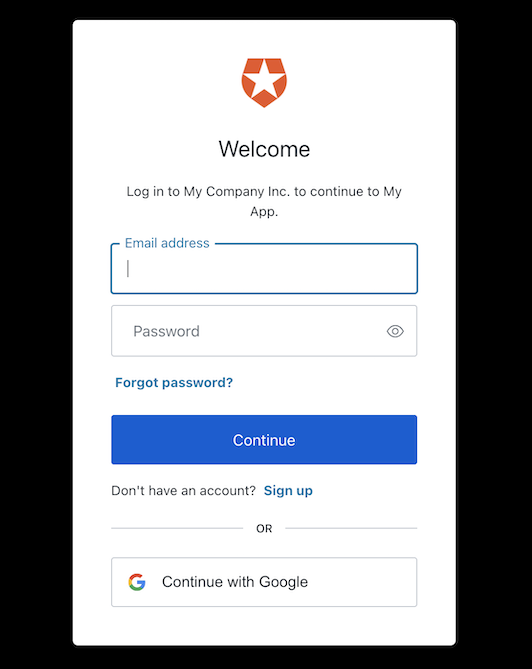

<h2>Motivation</h2>
Add auth0 authnetication (in particular social) to next.js

<h2>steps</h2>
<ol>
<li><h3>create a react project on auth0</h3></li>
<li><h3>get from the project application setting</h3> : Domain , Client ID and Client Secret from the project setting</li>
<li><h3>set the callback url</h3> in the project application setting to : https://localhost:3000/api/auth/callback , http://localhost:3000/api/auth/callback ,https://https://next-js-auth0-playground.vercel.app/api/auth/callback </li>
<li><h3>set the logout url</h3> in the project application setting to : https://localhost:3000 , http://localhost:3000 , https://next-js-auth0-playground.vercel.app</li>
<li><h3>install nextjs-auth0 </h3>: npm install @auth0/nextjs-auth0</li>
<li><h3>add .env.local file </h3>on the project root with the following
<ul>
<li>AUTH0_SECRET='use [openssl rand -hex 32] to generate a 32 bytes value'. this is A long secret value used to encrypt the session cookie. You can generate a suitable string using openssl rand -hex 32 on the command line</li>   
<li>AUTH0_BASE_URL='http://localhost:3000'. this is the base URL of your application on development. use https://next-js-auth0-playground.vercel.app for production</li>
<li>AUTH0_ISSUER_BASE_URL='https://YOUR_DOMAIN'. This is The URL of your Auth0 tenant domain. If you are using a Custom Domain with Auth0, set this to the value of your Custom Domain instead of the value reflected in the "Settings" tab.</li>
<li>AUTH0_CLIENT_ID='YOUR_CLIENT_ID'. This is Your Auth0 application's Client ID</li>
<li>AUTH0_CLIENT_SECRET='YOUR_CLIENT_SECRET'. This is your Auth0 application's Client Secret</li>
</ul>

<li>
<h3>Add the dynamic API route</h3>
Create an auth directory under the pages/api directory. Then, create a [...auth0].ts file under the newly created auth directory. The path to your dynamic API route file should then be pages/api/auth/[...auth0].ts.

```typescript
// pages/api/auth/[...auth0].js
import { handleAuth } from '@auth0/nextjs-auth0';

export default handleAuth();
```

Under the hood, handleAuth() creates the following routes:

    /api/auth/login: The route used to perform login with Auth0.
    /api/auth/logout: The route used to log the user out.
    /api/auth/callback: The route Auth0 will redirect the user to after a successful login.
    /api/auth/me: The route to fetch the user profile from.
</li>

<li>
<h3>Add the UserProvider component</h3>
On the frontend side, the SDK uses React Context to manage the authentication state of your users. To make that state available to all your pages, you need to override the App component and wrap its inner component with a UserProvider. Create the file pages/_app.js as follows:

```typescript
// pages/_app.js
import React from 'react';
import { UserProvider } from '@auth0/nextjs-auth0/client';

export default function App({ Component, pageProps }) {
  return (
    <UserProvider>
      <Component {...pageProps} />
    </UserProvider>
  );
}
```
The authentication state exposed by UserProvider can be accessed in any component using the useUser() hook.
</li>
<li>
<h3>Add Login to Your Application</h3>

A user can now log in to your application by visiting the /api/auth/login route provided by the SDK. Add a link to your login route using an anchor tag.

```html
<a href="/api/auth/login">Login</a>
```

<h6>Checkpoint</h6>

Add the login link to your application. When you click it, verify that your Next.js application redirects you to the Auth0 Universal Login page and that you can now log in or sign up using a username and password or a social provider.

Once that's complete, verify that Auth0 redirects back to your application.




</li>

<li>
<h3>Add Logout to Your Application</h3>
Now that you can log in to your Next.js application, you need a way to log out. You can add a link that points to the /api/auth/logout API route. Clicking it redirects your users to your Auth0 logout endpoint (https://YOUR_DOMAIN/v2/logout) and then immediately redirects them back to your application.

```html
<a href="/api/auth/logout">Logout</a>
```
</li>

<li>
<h3>Show User Profile Information</h3>
he Auth0 Next.js SDK helps you retrieve the profile information associated with the logged-in user, such as their name or profile picture, to personalize the user interface. The profile information is available through the user property exposed by the useUser() hook. Take this Profile component as an example of how to use it:

```typescript
import React from 'react';
import { useUser } from '@auth0/nextjs-auth0/client';

export default function Profile() {
  const { user, error, isLoading } = useUser();

  if (isLoading) return <div>Loading...</div>;
  if (error) return <div>{error.message}</div>;

  return (
    user && (
      <div>
        
        <h2>{user.name}</h2>
        <p>{user.email}</p>
      </div>
    )
  );
}
```

</li>

</ul>
</ol>


<h2>References</h2>
<a href='https://auth0.com/docs/quickstart/webapp/nextjs'>here</a>
